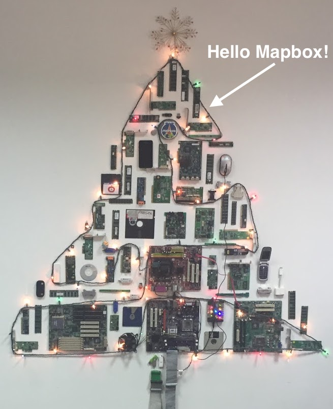

# Hello Mapbox!

## Why I'm Reaching Out

I'm interested in joining your team as a [Senior Frontend Engineer](https://boards.greenhouse.io/mapbox/jobs/1005728?gh_jid=1005728), or _possibly_ as a [Sales Engineer](https://boards.greenhouse.io/mapbox/jobs/962447?gh_jid=962447).

## Why I Love Mapbox

I first heard about Mapbox from some friends in Cuba's open source mapping community when I was visiting an the Historian's Office in Old Havana and saw a Mapbox sticker on their Christmas tree. **I love the fact that Mapbox is creating open source software that's useful for my friends around the world.**

Last week, while talking to a co-worker at NASA Goddard about looking for a job with good company culture, she recommended that I check out Mapbox. She said **Mapbox is highly rated for cultivating a positive working environment, mentorship and equal opportunities** for men and women and she said that she thought it might be exactly what I'm looking for.

So I decided to check out your careers page, and I *loved* what I saw! **The culture of open communication, empathy, valuing diverse perspectives, constant learning, and a passion for building great things really resonates with me!** The Senior Frontend role you're looking to fill fits well with my skills and experience, and the fact that you have Sales Engineer opportunites is something that interests me as well, since I'd like to transition into software sales in the next few years.

## Why You'll Love Me

The reasons I'm a good fit for Mapbox and the Senior Frontend role;

- I have 8 years of experience with frontend JavaScript frameworks including React and Redux
- I love collaboration and feedback, and I'm used to doing those things in the open on GitHub
- I believe open communication is essential
- I'm great at expressing ideas with grace and clarity as a result of my background in communication and my high empathy for others
- I'm a self-motivated, constant learner and I'm always asking questions to increase my understanding
- I love to give 110% to the things I do
- I'm passionate about constant improvement for myself and my team
_ I love teaching and mentoring others
- I value great strategy and clean execution
- I love questioning assumptions and constantly pushing to improve a product
- I prioritize listening and getting perspectives from people who see things differently than I do

## Let's Talk!

As you can see, there's a lot of overlap in our values and the skills and experience you're looking for matches the skills and experience I have. I'm looking forward to talking more with you about opportunities to work together.
